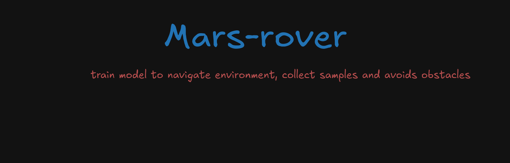
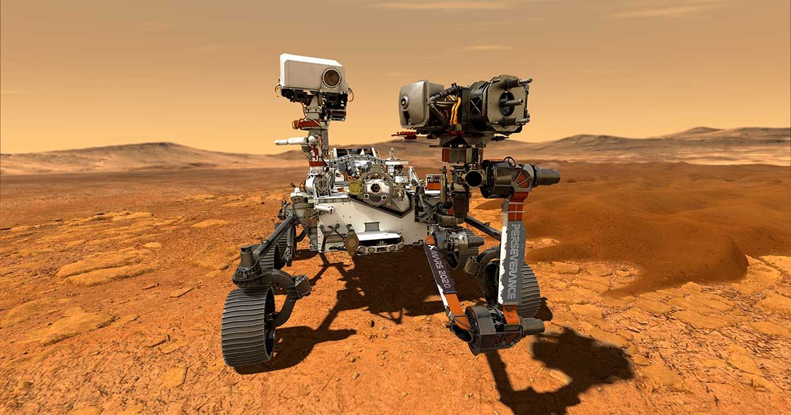

# Mars Rover Reinforcement Learning Project

A Python-based reinforcement learning project that trains a Mars rover to navigate a grid environment, collect samples, and avoid obstacles using Deep Q-Learning (DQN).

## Features

- Grid-based Mars environment simulation
- Deep Q-Network (DQN) implementation for rover control
- Support for both CPU and GPU training
- Automated results logging and visualization
- Real-time training progress tracking
- Console-based environment rendering option




## Project Structure

```
mars_rover/
├── src/
│   ├── rover.py          # Core DQN agent and environment implementation
│   └── results_handler.py # Training results and metrics management
├── main.py               # Main training script with CLI interface
├── requirements.txt      # Project dependencies
└── README.md            # Project documentation
```

## Requirements

- Python 3.8+
- TensorFlow 2.x
- NumPy
- Matplotlib
- GPU support (optional, for faster training)

## Installation

1. Clone the repository:
```bash
git clone https://github.com/prateekshukla1108/mars-rover.git
cd mars-rover
```

2. Create and activate a virtual environment (recommended):
```bash
python -m venv venv
source venv/bin/activate  # On Windows: venv\Scripts\activate
```

3. Install dependencies:
```bash
pip install -r requirements.txt
```

## Usage

### Basic Training

Run the training script with default parameters:

```bash
python main.py
```

### Advanced Options

The training script supports several command-line arguments:

- `--episodes`: Number of training episodes (default: 100)
- `--grid-size`: Size of the environment grid (default: 10)
- `--max-steps`: Maximum steps per episode (default: 500)
- `--render`: Enable console-based visualization
- `--results-dir`: Directory to save results (default: 'results')

Example with custom parameters:

```bash
python main.py --episodes 200 --grid-size 15 --render --results-dir custom_results
```

## Environment Details

The Mars environment is represented as a grid where:
- Empty spaces are marked as '·'
- Obstacles (rocks) are marked as '▲'
- Sample collection points are marked as '◆'
- The rover position is marked as '█'

### Reward Structure

- Collecting a sample: +20 points
- Collecting all samples: +50 bonus points
- Hitting an obstacle: -10 points
- Hitting boundary: -5 points
- Each move: -1 point (encourages efficient paths)

## Training Results

The results handler automatically saves:
- Episode-by-episode metrics in CSV format
- Training configuration and device information in JSON
- Training visualization plots
- Final summary statistics

Results are saved in timestamped directories under the specified results directory.

## Implementation Notes

### DQN Agent

The DQN implementation features:
- Experience replay buffer
- Epsilon-greedy exploration
- Automatic GPU detection and utilization
- Mixed precision training when GPU is available

### Performance Optimization

- Automatic GPU detection and configuration
- Memory growth management for GPU training
- Optimized batch processing
- Efficient state representation

## Development

To extend or modify the project:

1. Environment modifications can be made in `src/rover.py` class `MarsEnvironment`
2. Agent modifications can be made in `src/rover.py` class `DQNAgent`
3. Results handling can be customized in `src/results_handler.py`
